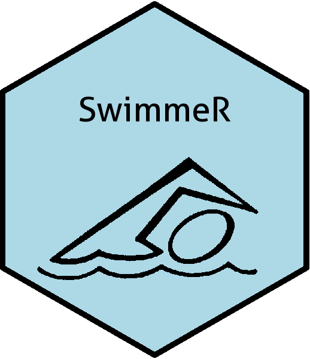
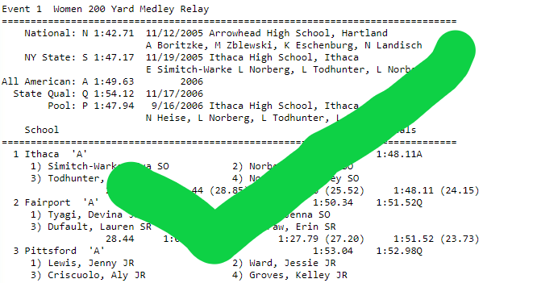
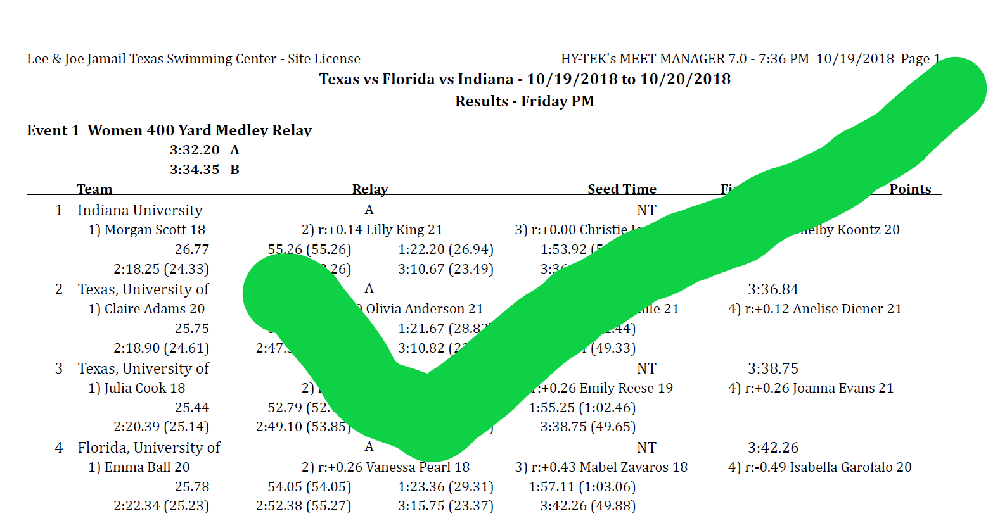
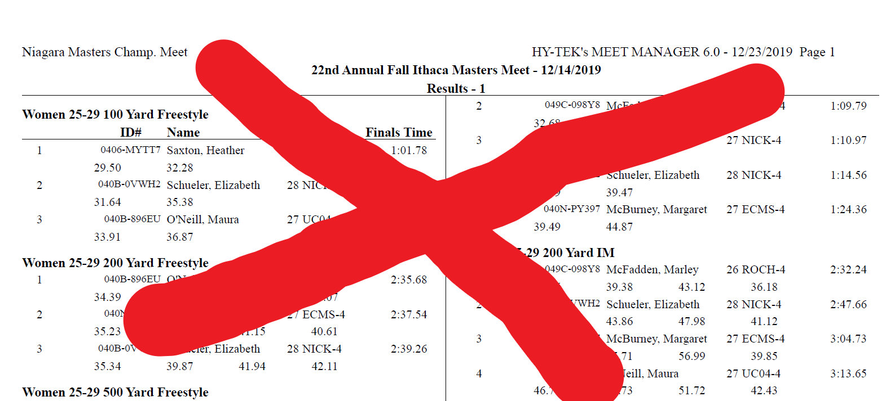

# SwimmeR 

[](https://cran.r-project.org/package=SwimmeR)
[](https://cran.r-project.org/package=SwimmeR)
[](https://cran.r-project.org/package=SwimmeR)
[](https://cran.r-project.org/package=SwimmeR)

`SwimmeR` is intended to assist those working with times from competitive pool swimming races, such as those conducted under the NHFS, NCAA, or FINA.  For more information please see `vignette("SwimmeR")`.

### Latest Released Version from CRAN

`install.packages("SwimmeR")`

`library(SwimmeR)`

### Latest Development Version from Github

Version 0.11.4

* Further improvements for handling Tokyo Olympics results

`devtools::install_github("gpilgrim2670/SwimmeR", build_vignettes = TRUE)`

# Usage

`SwimmeR` has two major uses - importing results and formatting times.  It also has functions for course conversions and drawing brackets.

## Importing Results

`SwimmeR` reads swimming results into R and outputs tidy data frames of the results.  `SwimmeR` uses `read_results` to read in either a PDF or HTML file (like a url) and the `swim_parse` or `swim_parse_ISL` function to convert the read file to a tidy data frame.  Reading .hy3 files is also now possible with `swim_parse`, although .hy3 functionality is still under development and quite buggy.  As of version 0.7.0 `SwimmeR` can also read S.A.M.M.S. style results.

`read_results` has two arguments, `file`, which is the file path to read in, and `node`, required only for HTML files, this is a CSS node where the results reside.  `node` defaults to `"pre"`, which has been correct in every instance tested thus far.

`swim_parse` has seven arguments as of version 0.7.0.

`file` is the output of `read_results` and is required.

`avoid` is a list of strings.  Rows in `file` containing any of those strings will not be included.  `avoid` is optional.  Incorrectly specifying it may lead to nonsense rows in the final data frame, but will not cause an error.  Nonsense rows can be removed after import.  

`typo` and `replacement` work together to fix typos, by replacing them with replacements.  Strings in `typo` will be replaced by strings in `replacement` in element index order - that is the first element of `typo` will be replaced everywhere it appears by the first element of `replacement`.  Typos can cause lost data and nonsense rows.

See `?swim_parse` or the package vignette for more information.

*The following three arguments are only available in `SwimmeR v0.6.0` and higher*

`splits` and `split_length` tell `swim_parse` if and how to import split times.  Setting `splits = TRUE` will import splits as columns.  `split_length` refers to the pool course (length) as defaults to `50`.  It may also be set to `25`, if splits are recorded every 25 rather than every 50.  Split reporting within source files is very inconsistent, so while `swim_parse` will import whatever splits are present they may require some inspection after import.
`swim_parse_ISL` also has a `splits` argument that works the same way.  Set `splits = TRUE` to record splits.
See the Splits sections of `vignette("SwimmeR")` for more information and examples.  

`relay_swimmers` tells `swim_parse` or `swim_parse_ISL` whether or not to include the names of relay swimmers as additional columns.  Set `relay_swimmers = TRUE` to include.  There is more information available in `vignette("SwimmeR")`

```r
swim_parse(
    read_results(
      "http://www.nyhsswim.com/Results/Boys/2008/NYS/Single.htm"
    ),
    typo = c("-1NORTH ROCKL"),
    replacement = c("1-NORTH ROCKL"),
    splits = TRUE, # requires version 0.6.0 or greater
    relay_swimmers = TRUE # requires version 0.6.0 or greater
  )
```

`swim_parse_ISL` only requires one argument, `file`, the output of `read_results`.

```r
swim_parse_ISL(
    file = read_results(
      "https://isl.global/wp-content/uploads/2019/10/isl-indianapols-results-day-2-2.pdf"),
      splits = TRUE, # requires version 0.6.0 or greater
      relay_swimmers = TRUE # requires version 0.6.0 or greater
  )
```

### Imported Information

`swim_parse` will attempt to capture the following information, assuming it is present in the raw results.

`Place`: Order of finish

`Name`: An athlete's name.  Relays do not have ages

`Age`: Could be a number of years (25) or a year in school (SR)

`Para`: An athlete's para-swimming classification (e.g. S10)

`Team`: The name of a team, for athletes or relays

`Prelims_Time`: If two times/scores are listed, this is the first one.  `swim_parse` currently can't differentiate between a seed time and a prelims time.  They're both called `Prelims_Time`.  Prelim/seed diving scores are also included here even though they're not technically times.

`Finals_Time`: If two times/scores are listed this is the second one.  If only one time/score is listed this is it.

`DQ`: Was an athlete/relay team disqualified

`Exhibition`: Was an athlete/relay team competing as a non-scoring (exhibition) entry

`Points`: Points award based on place (not diving score)

`Relay_Swimmer_X`: Names of athletes in a relay

`Split_X`: Split corresponding to a given distance X


### Usable Formats

`SwimmeR` can only read files in single column format, not double.

### Will work - results in single column


### Will also work - results in single column


### Will not work - results in multiple columns


## Formatting Times

`SwimmeR` also converts times between the conventional swimming format of minutes:seconds.hundredths (1:35.37) and the computationally useful format of seconds, reported to the 100ths place (e.g. 95.37).  This is accomplished with `sec_format` and `mmss_format`, which are inverses of one another.  Both `sec_format` and `mmss_format` work well with `tidyverse` functions.

```r
times <- c("1:35.97", "57.34", "16:53.19", NA)
times_sec <- sec_format(times)
times_sec
times_mmss <- mmss_format(times_sec)
times_mmss
all.equal(times, times_mmss)
```

## Regularizing Team Names

Team names are often abbreviated.  Rather than specifying every abbreviation `SwimmeR` provides `get_mode` to make the task simpler.

```
name <- c(rep("Lilly King", 5), rep("James Sullivan", 3))
team <- c(rep("IU", 2), "Indiana", "IUWSD", "Indiana University", rep("Monsters University", 2), "MU")
df <- data.frame(name, team, stringsAsFactors = FALSE)
df %>% 
  group_by(name) %>% 
  mutate(Team = get_mode(team))
```

## Reordering Athlete Names

Athlete names are sometimes formatted as "Firstname Lastname" and sometimes as "Lastname, Firstname".  For purposes of plotting and presentation it's often desirable to format all names the same way.  The `name_reorder` function, available in versions >= 0.8.0, will reorder all "Lastname, Firstname" names as "Firstname Lastname".

```
df <- data.frame(Name = c("King, Lilly", "Lilly King", NA, "Richards Ross, Sanya", "Phelps, Michael F"))
name_reorder(df)
```

While "Lastname, Firstname" is actually more informative in that it differentiates between last names and first names it's not always possible to convert "Firstname Lastname" to "Lastname, Firstname".  Consider an athlete named "Michael Fred Phelps II" - it's not possible to determine programmatically where a comma should go.  Is it "II, Michael Fred Phelps"?  Or maybe "Fred Phelps II, Michael"?  There's no way to tell.  On the other hand converting "Phelps II, Michael Fred" to "Michael Fred Phelps II" is straightforward.

### Drawing brackets

Brackets for single elimination tournaments can be produced for any number of teams between 5 and 64.  Byes will automatically be included for higher seeds as required.

```r
teams <- c("red", "orange", "yellow", "green", "blue", "indigo", "violet")
round_two <- c("red", "yellow", "blue", "indigo")
round_three <- c("red", "blue")
champion <- "red"
draw_bracket(teams = teams,
            round_two = round_two,
            round_three = round_three,
            champion = champion)
```

### Course conversions

Additionally 'SwimmeR' also converts between the various pool sizes used in competitive swimming, namely 50m length (LCM), 25m length (SCM) and 25y length (SCY).  This is accomplished with `course_convert`.  The `verbose` parameter determines what `course_convert` outputs.  Setting `verbose = FALSE` (the default) returns a data frame including the input variables whereas `verbose = TRUE` only returns the converted time(s).  `course_convert` will take inputs in either seconds or swimming format.

```r
swim <- tibble(time = c("6:17.53", "59.14", "4:14.32", "16:43.19"), course = c("LCM", "LCM", "SCY", "SCM"), course_to = c("SCY", "SCY", "SCM", "LCM"), event = c("400 Free", "100 Fly", "400 IM", "1650 Free"))

course_convert(time = swim$time, course = swim$course, course_to = swim$course_to, event = swim$event)

course_convert(time = swim$time, course = swim$course, course_to = swim$course_to, event = swim$event, verbose = TRUE)
```

## Getting help

I do a lot of demos on how to use `SwimmeR` at my blog [Swimming + Data Science](https://pilgrim.netlify.app/).

`SwimmeR` also has a vignette.  Call `vignette("SwimmeR")`.  If you download from github don't forget to set `build_vignettes = TRUE`.

If you find bug, please provide a minimal reproducible example at [github](https://github.com/gpilgrim2670/SwimmeR).
